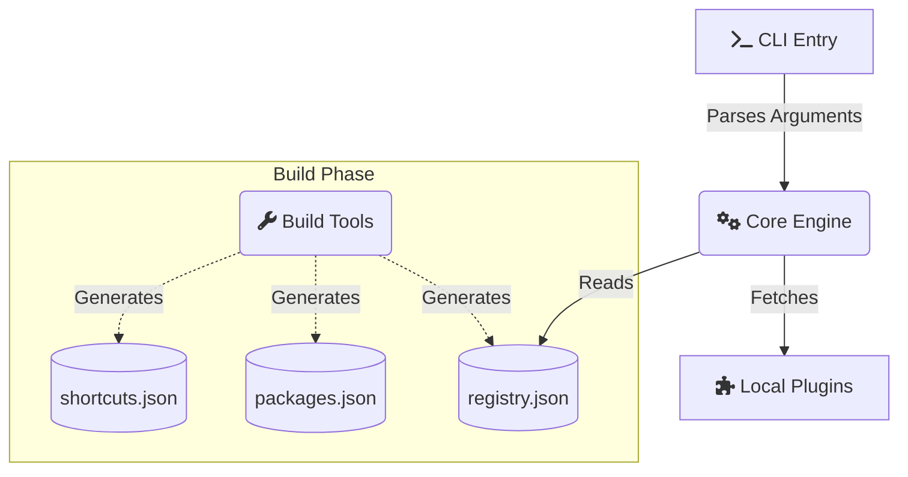

<!-- 
  Title: NexaCore Plugin Manager
  Description: NexaCore is the next-generation architecture for autonomous AI agents, enabling fast execution and seamless modularity for AI development workflows.
  Keywords: AI, agents, autonomous, modular, plugin manager, node.js, javascript, plugins, extension, architecture, nexacore, ai tools, developer tools
-->

<div align="center">


# 🔮 Awesome-Antigravity-Skills 🔮

**The Next-Generation Architecture for Autonomous AI Agents**

<a href="https://github.com/ishandutta2007/Awesome-Awesome-Awesome"></a><a href="https://discord.gg/jc4xtF58Ve"></a>
[](https://github.com/)
[](https://opensource.org/licenses/MIT)
[](https://github.com/)
[](https://nodejs.org)
[](https://github.com/)
[](https://discord.com/)
<a href="https://github.com/ishandutta2007"></a>

<p align="center">
  <i>Supercharge your development workflow with hyper-optimized, composable modules.</i>
</p>

</div>

---

## ⚡ What is Awesome-Antigravity-Skills?

**Awesome-Antigravity-Skills** is a robust, lightning-fast plugin ecosystem designed from the ground up for modern developers. It empowers developers and AI agents alike to compose, manage, and distribute modular capabilities without friction. 

Whether you are extending an existing CLI or building a brand new autonomous agent, Awesome-Antigravity-Skills acts as the central nervous system for your tools.

---

## 🌌 Key Highlights

<details>
<summary><b>1. 🚀 Blazing Fast Execution</b></summary>
<p>Written entirely in optimized JavaScript, Awesome-Antigravity-Skills ensures zero-latency plugin resolution and execution, minimizing the overhead for your agents.</p>
</details>

<details>
<summary><b>2. 🧩 Seamless Modularity</b></summary>
<p>Every plugin is strictly isolated, yet flawlessly integrated via our <code>core</code> engine, ensuring that breaking changes in one module never impact the whole.</p>
</details>

<details>
<summary><b>3. 🛠️ Intelligent CLI Tooling</b></summary>
<p>Ship with confidence using our built-in CLI that validates, installs, and updates your plugins effortlessly via <code>registry.json</code>.</p>
</details>

---

## 🏗️ Architecture Overview

The Awesome-Antigravity-Skills ecosystem operates on a highly decoupled architecture. The diagram below illustrates how the internal systems interact:



### Directory Taxonomy

| Directory | Purpose |
|:---:|:---|
| 📂 `core/` | The brain of Awesome-Antigravity-Skills. Contains the schema validator and utility libraries. |
| 📂 `cli-entry/` | Houses the `cli.js` entrypoint for direct terminal invocation. |
| 📂 `plugins/` | The raw source code and metadata for all available agent modules. |
| 📂 `build-tools/` | Build scripts used to dynamically generate the `registry.json` cache. |
| 📂 `specs/` | The comprehensive Node.js test suite ensuring 100% stability. |

---

## 💻 Getting Started

### Installation

Awesome-Antigravity-Skills is deployed as a global package. Simply install it via NPM:

```bash
npm install -g awesome-antigravity-skills
```

### CLI Quickstart

Manage your environment effortlessly with our CLI:

```bash
# 🔍 Search the registry for a specific tool
ag-skills search "python debugging"

# 📥 Install a plugin to your local agent environment
ag-skills install python-pro

# 🔄 Update an installed plugin
ag-skills update python-pro

# 🏥 Verify the health of your installation
ag-skills doctor
```

> [!TIP]
> **Advanced Users:** You can override the local installation path by setting the `AG_SKILLS_DIR` environment variable before running commands!

---

## 🤝 Contributing

We love contributions! If you're building a new plugin for Awesome-Antigravity-Skills:
1. Fork this repository.
2. Add your plugin under the `plugins/` directory.
3. Ensure you have a valid `SKILL.md` defining your module.
4. Run the build tools (`npm run build:catalog`) to update `registry.json`.
5. Run the specs (`npm run test`) to guarantee everything passes.
6. Open a Pull Request!

---

<div align="center">
  <p>Built with 🩵 by the Awesome-Antigravity-Skills Community</p>
</div>

##  Star History
<div align="center">
<a href="https://www.star-history.com/?repos=ishandutta2007%2FAwesome-Antigravity-Skills&type=date&legend=bottom-right">
<picture>
<source media="(prefers-color-scheme: dark)" srcset="https://api.star-history.com/chart?repos=ishandutta2007/Awesome-Antigravity-Skills&type=date&theme=dark&legend=bottom-right" />
<source media="(prefers-color-scheme: light)" srcset="https://api.star-history.com/chart?repos=ishandutta2007/Awesome-Antigravity-Skills&type=date&legend=bottom-right" />

</picture>
</a>
</div>
